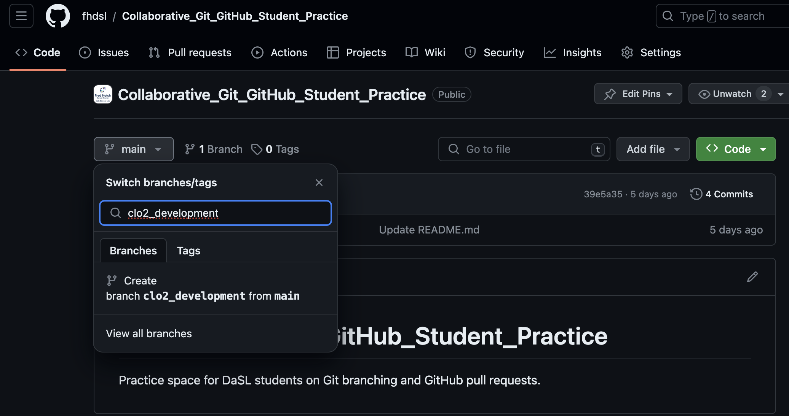
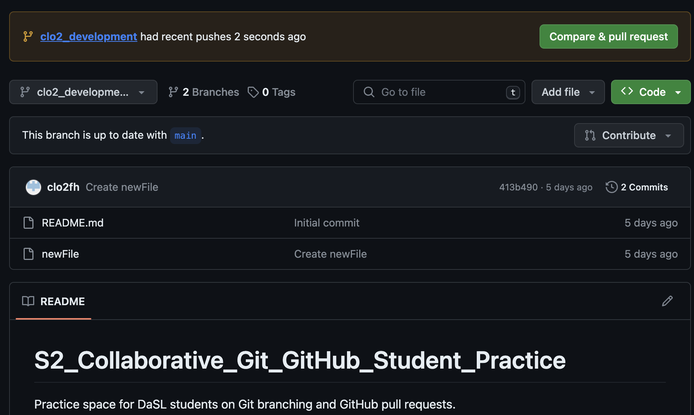

```{r, include = FALSE}
ottrpal::set_knitr_image_path()
```

# Workshop Notes

## Review Intro to Git material

During the Intro to Git workshop, we summarized Git in two mental models. The *first model* is the idea of making sequential commits to save your work's history with a metadata, as shown below.


This can also be illustrated with symbols below:

```         
o <-- o <-- o <-- o
```

where each `o` is a commit of the repository's state.

The *second model* zooms in and focuses on the state of a file:


Given a new, Untracked file in your repository, you can add it to your repository via `git add`. This sets your file to the Staged state. Then, to make a commit, you use `git commit`.

With new *edits*, the file becomes a Modified stage. You can then stage the file again via `git add`, and then make another commit via `git commit`. This cycle repeats in your local repository.

When you want to share your repository to a remote, such as GitHub, you use `git push`. If you have any collaborators also pushing to the repository and you want to see their updates, you use `git pull` to get the remote changes to your local repository.

In summary, here are the file states:

-   **Untracked** means that your file is in the local repository file directory, but is not being tracked by Git.

-   **Modified** means that you have changed the file but have not committed it to your local repository yet.

-   **Staged** means that you have marked a modified file in its current version to go into your next commit.

-   **Committed** means that the data is safely stored in your local repository.

-   **Pushed** means that the your changes have been made to the remote (ie. GitHub).

## Intro to Branching and Merging

Today, we are going to think about how multiple people can collaborate on a Git repository. How can we keep track of multiple people's work clearly and transparently without stepping on each others' toes?

Suppose we start a project in a linear commit structure, as before:

```         
o <-- o <-- o <-- o
```

Suppose that another collaborator joins in and wants to develop a separate feature, while you continue on the project. It is possible to create a **branch** structure, in a situation where two separate features of the project are being made in parallel:

```         
o <-- o <-- o <-- o
            ^
             \
              --- o <-- o
```

When both features are complete, one could merge them together to have an unified, unbranched repository:

```         
o <-- o <-- o <-- o <---- o
            ^            /
             \          v
              --- o <-- o
```

This process in Git is called **branching**, when two branching commit paths are created, and **merging**, when two branches are integrated together.

This branch and merge workflow can be used for collaborative projects, but can also be useful for a single user. A project maintained by one developer may branch out into various working ideas, and this branch and merge workflow keeps track of that nicely.

We will first see how to do this in Git for a single user, then see how it can be done collaboratively with GitHub.

## Set up

### Installing Git

If you are learning via replit, then Git is already installed. See this guide for [installation info](https://git-scm.com/book/en/v2/Getting-Started-Installing-Git) on your local computer.

### Installing GitHub Command Line Tools

If you are learning via replit, then GitHub Command Line Tools is already installed. See this website for [installation info](https://cli.github.com/) on your local computer. This tool connects your local repository to your GitHub repository.

### Create a GitHub account

Create your GitHub account [here](https://github.com/login).

### Adding your information for Git

This helps Git record your author information when you make commits:

```         
% git config --global user.name "Your Name"
% git config --global user.email "address@email.com"
```

Replace `Your Name` with your name and `address@email.com` with your email address.

### Connecting Git to your GitHub account

We connect Git to your GitHub account via GitHub CLI:

```         
% gh auth login
```

You will be asked how you want to log in, and pick the following:

```         
? What account do you want to log into? GitHub.com
? What is your preferred protocol for Git operations? HTTPS
? Authenticate Git with your GitHub credentials? Yes
? How would you like to authenticate GitHub CLI? Login with a web browser
```

You will be given a code, and you will provide that code to GitHub via <https://github.com/login/device>.

### Optional: change text editor

We will tell Git what text editor to use to create commit messages. If you are new to command line text editors, `nano` is a simple one to learn. Other common ones are `vim` and `emacs`.

```         
% git config --global core.editor "nano"
```

## Branching

Let's create a local repository to practice branching:

```         
% mkdir sandbox
% cd sandbox
% git init
% touch README
% git add README
% git commit -m "Added README"
```

Let's look at the branches in this repository:

```         
% git branch
* main
```

The star `*` shows which branch we are looking at.

We are on the `main` branch in this repository, as expected.

Let's create a new branch:

```         
% git branch development
% git branch
  development
* main
```

Another way to look at which branch we are on is via `git log`:

```         
% git log
commit 657fcbea5a023041d359a8f1fcfc9fbf7e64f68e (HEAD -> main, development)
Merge: 875d774 413b490
Author: Your Name <you@example.com>
Date:   Wed Dec 6 23:47:39 2023 +0000

   Initial commit
```

The `HEAD` **pointer** tells us "What am I looking at?" in our local file system. If we want to look at other branches, then we need to move the `HEAD` pointer to that branch. Currently, we are looking at the `main` branch in our local file system.

Let's work on the `development` branch and make a commit. We use the command `git checkout` to switch to a different branch:

```         
% git checkout development
Switched to branch 'development'
% echo "Additional README info" >> README.md 
% git add README.md 
% git commit -m "updated README"
```

Let's look at our `git log`:

```         
% git log
commit 260c8099f0ea82199805325a6fbe26bfc3cbd1aa (HEAD -> development)
Author: Your Name <you@example.com>
Date:   Thu Dec 7 00:14:02 2023 +0000

    updated README

commit 657fcbea5a023041d359a8f1fcfc9fbf7e64f68e (main)
Merge: 875d774 413b490
Author: Your Name <you@example.com>
Date:   Wed Dec 6 23:47:39 2023 +0000

    Initial commit
```

Now, our branch `development` is ahead of the `main` branch by one commit. We can toggle between two branches via `git checkout` as before.

Let's create a third branch, called `quickFix`, and make a commit, and look at the log. Notice that when we make a new branch, it is branching *relatively* to the branch that is checked out. For this example, we want to branch *relatively* to `main`, so we check out the `main` branch before creating `quickFix`

```         
% git checkout main
Switched to 'main'
% git branch quickFix
% echo "quick fix!" >> quickFix.txt
% git add quickFix.txt 
% git commit -m "add quickFix.txt"
% git log --graph --all
* commit b6c97d0a1e7249da9d5a590534b57dd17754b5b8 (HEAD -> quickFix)
| Author: Your Name <you@example.com>
| Date:   Thu Dec 7 00:40:25 2023 +0000
| 
|     add quickFix.txt
|   
| * commit 260c8099f0ea82199805325a6fbe26bfc3cbd1aa (development)
|/  Author: Your Name <you@example.com>
|   Date:   Thu Dec 7 00:14:02 2023 +0000
|   
|       updated README
|   
*   commit 657fcbea5a023041d359a8f1fcfc9fbf7e64f68e (main)
|   Merge: 875d774 413b490
|   Author: Your Name <you@example.com>
|   Date:   Wed Dec 6 23:47:39 2023 +0000
|   
|       Initial commit
```

Here, we used `git log --graph --all` so that it can display the branching structure graphically.

Essentially, we have created this structure:

```         
o <-- o <-- o <-- o
            ^
             \
              --- o 
```

## Merging

Great! Now we have developed two features from our `main` branch, and we should merge `development` and `quickFix` back to the `main` branch, sequentially.

All you have to do is checkout the branch you wish to merge into and then run `git merge [branchName]` on the branch of interest:

```         
% git checkout main
Switched to branch 'main'
% git merge development 
Merge branch 'main' of https://github.com/fhdsl/S2_Collaborative_Git_GitHub_Student_Practice
Updating 657fcbe..260c809
Fast-forward
% git log --all --graph
* commit b6c97d0a1e7249da9d5a590534b57dd17754b5b8 (quickFix)
| Author: Your Name <you@example.com>
| Date:   Thu Dec 7 00:40:25 2023 +0000
| 
|     add quickFix.txt
|   
| * commit 260c8099f0ea82199805325a6fbe26bfc3cbd1aa (HEAD -> main, development)
|/  Author: Your Name <you@example.com>
|   Date:   Thu Dec 7 00:14:02 2023 +0000
|   
|       updated README
|   
```

Great, you have completed one of the merges. Let's do the second merge.

```         
% git merge quickFix
Merge made by the 'ort' strategy.
 quickFix.txt | 1 +
 1 file changed, 1 insertion(+)
 create mode 100644 quickFix.txt
~/project/S2_Collaborative_Git_GitHub_Student_Practice$ git log --all --graph
*   commit e05111a537b6f9c5dd11b15f0fc28feb27940fcf (HEAD -> main)
|\  Merge: 260c809 b6c97d0
| | Author: Your Name <you@example.com>
| | Date:   Fri Dec 8 18:59:45 2023 +0000
| | 
| |     Merge branch 'quickFix'
| |     
| | 
| * commit b6c97d0a1e7249da9d5a590534b57dd17754b5b8 (quickFix)
| | Author: Your Name <you@example.com>
| | Date:   Thu Dec 7 00:40:25 2023 +0000
| | 
| |     add quickFix.txt
| | 
* | commit 260c8099f0ea82199805325a6fbe26bfc3cbd1aa (development)
|/  Author: Your Name <you@example.com>
|   Date:   Thu Dec 7 00:14:02 2023 +0000
|   
|       updated README
|   
```

In the process, you had to make a merge commit, because your development history has branched and Git needs to consider the two divergent branches as well as the common ancestor to make the merge happen.

### Deleting branches

You can now delete this branch, if you like.

```         
% git branch -d development
% git branch -d quickFix
```

### Merge conflicts

Sometimes, when merging branches together, there will be changes that will be in conflicts with each other. Git will stop the merging process and ask you to fix these conflicts before allowing you to complete the merge. Here is a nice [guide](https://docs.github.com/en/pull-requests/collaborating-with-pull-requests/addressing-merge-conflicts/resolving-a-merge-conflict-using-the-command-line) that explains the process.

## Pull requests

What we have learned so far about branching and merging has been on the local repository. This is great for individual work. To let multiple people branch and merge, we will learn how to do it with a remote repository on GitHub via the **pull request model**.

### Connect to course GitHub repository

If you are enrolled in the course, we will add you to [this repository](https://github.com/fhdsl/S2_Collaborative_Git_GitHub_Student_Practice.git).

Then, clone the remote repository in your local environment:

```         
% git clone https://github.com/fhdsl/S2_Collaborative_Git_GitHub_Student_Practice.git
```

The **pull request model** is a framework of branching and merging with collaborators on GitHub. The working model is essentially identical of what we have done already: you create a branch for your own work, make some commits, and merge it back to the main branch. The process of merging a branch back to the main branch on GitHub is called a **pull request**, which is the same as `git merge` but with more documentation and approval.

### Branching with remotes

To create a new branch on your remote, you can use the GitHub website:



The branch `clo2_development` is created on the remote, but it hasn't been updated locally. We run `git pull` locally to update it and switch to that branch via `git checkout`.

```         
% git pull
From https://github.com/fhdsl/S2_Collaborative_Git_GitHub_Student_Practice
 * [new branch]      clo2_development -> origin/clo2_development
Already up to date.

% git checkout clo2_development
Branch 'clo2_development' set up to track remote branch 'clo2_development' from 'origin'.
Switched to a new branch 'clo2_development'
```

Then, we can make some new commits and pushes to this branch:

```         
% echo "branch edits" >> README.md
% git add README.md
% git commit -m "edited README.md"
% git push
```

After a variable number of commits and pushes, your remote branch is a different version of the remote main branch with new improvements. But our main goal is to add those improvements to the main remote branch. To start this process of bringing in new changes, we will create a **pull request**.

### Pull Requests

A **pull request** is a way to propose changes from a branch before it is merged back into the main repository. It is just like `git merge`, but it requires more documentation and confirmation. For instance, a collaborator can create their own work on a branch, and then create a pull request to have that new branch's feature to be integrated back to the main branch. The owner of the repository sometimes review the proposed changes before accepting the pull request.


When you have pushed changes to the branch, you will see an option to *"Compare & pull request"*. Click on it.



You will see that you are trying to merge `clo2_development` into `main` on the remote. It also requires you to write a description of what you did on your branch.


After you create the pull request, the author of the repository gets to decide whether a merge should be done on the pull request. Here, you are a contributing author of the repository, so you can approve it yourself. But you can imagine a situation where you need someone else to approve of the pull request: a dialogue can take place in this approval process, leading to additional commits to be made before the pull request is approved.


Click *"Merge pull request"* to finish!

### Merge conflicts during pull requests

Sometimes, when merging branches together during a pull request, there will be changes that will be in conflicts with each other. Again, GitHub will stop the process and ask you fix it. A nice guide to this can be found [here](https://docs.github.com/en/pull-requests/collaborating-with-pull-requests/addressing-merge-conflicts/resolving-a-merge-conflict-on-github).

### Code reviews during a pull request

Suppose that you want someone's approval of your pull request before it is merged. You can add other users in the repository to be a reviewer of your work. This process of code reviewing before a branch is merged is highly recommended in collaborative work.

Some advice for a creating helpful pull requests for reviewers:

-   it provides context of the code changes you made.

-   it asks for explicit feedback of what kind of feedback is needed.

-   it is a a small and modular change that can be discussed.

Some advice for reviewers responding to a pull request:

-   Do the proposed changes answer the solve the problem? Can you test it out in the working branch?

-   Is the code clear and readable? Does it contain a healthy amount of comments and documentation for individuals not familiar with the project to understand generally what is going on?

-   Is the code efficient with computational resources?

-   Does the code stick to the style and conventions of this project?

More advice on code review can be found here for [pull request authors](https://jhudatascience.org/Adv_Reproducibility_in_Cancer_Informatics/engaging-in-code-review---as-an-author.html), and [pull request reviewers](https://jhudatascience.org/Adv_Reproducibility_in_Cancer_Informatics/engaging-in-code-review---as-a-reviewer.html).

## Appendix: Local and remote as branches

Remember that there are now two versions of our repository when we are connected to a remote: one is **local** on your computer, and one is **remote** on GitHub. Both of these versions are considered branches. One is the local `main` branch, and one is the remote `main` branch.

Let's see these two branches via `git log`:

```         
% git log
commit 52a77982a629429a2119b681352f2939b6e83cdc (HEAD -> main, origin/main, origin/HEAD)
Author: Chris Lo <hidden@gmail.com>
Date:   Wed Dec 6 14:34:33 2023 -0800

    Initial commit
```

The remote `main` branch is designated as `origin/main`. There is another `HEAD` pointer on the remote as `origin/HEAD`, which we will not cover in detail here, but here is some [reference](https://superuser.com/questions/1192865/git-what-does-an-extra-item-origin-head-mean).

### Local and remote branches in action

Let's see our local and remote branches in action.

Suppose we make some local changes and commits, but don't push it to the remote immediately. What happens?

```         
% echo "Additional README info" >> README.md 
% git add README.md 
% git commit -m "updated README"

% git log
commit 875d774f67ee877cd239a980bc73613470b61ee1 (HEAD -> main)
Author: Your Name <you@example.com>
Date:   Wed Dec 6 23:25:16 2023 +0000

    updated README

commit 52a77982a629429a2119b681352f2939b6e83cdc (origin/main, origin/HEAD)
Author: Chris Lo <hidden@gmail.com>
Date:   Wed Dec 6 14:34:33 2023 -0800

    Initial commit
```

We see that the local `main` branch is ahead of the remote `origin/main` branch.

Each time we run `git push` or `git pull`, Git performs a `git merge` to sync `origin/main` to `main` (`git push`), or a performs a `git merge` to sync `main` to `origin/main` (`git pull`).

## Appendix: GitHub issues

GitHub issues are a way for people to give feedback on your repository. Here is a common scenario of using GitHub issues in the wild: you publish a piece of software on GitHub, and other users try it out. They are confused about how to run your code, because they are getting errors, so they return to the GitHub repository and post a GitHub issue documenting their error. You can then create a branch from this issue, make changes to your code to resolve the error, then use the pull request model to merge it back to the main branch! GitHub issues are also a common way to document to-do features you want to implement in the future.

## Appendix: References

-   [ProGit](https://git-scm.com/book/en/v2/Getting-Started-About-Version-Control): We covered chapter 3 in this workshop.

-   [DangItGit](https://dangitgit.com/): Excellent starting point for common Git problems.

-   [MIT's Git Seminar](https://missing.csail.mit.edu/2020/version-control/): A more computer science explanation of how Git works.

-   [Explain Shell](https://explainshell.com/): Access Shell and Git manual and help pages in an easy-to-read way.
